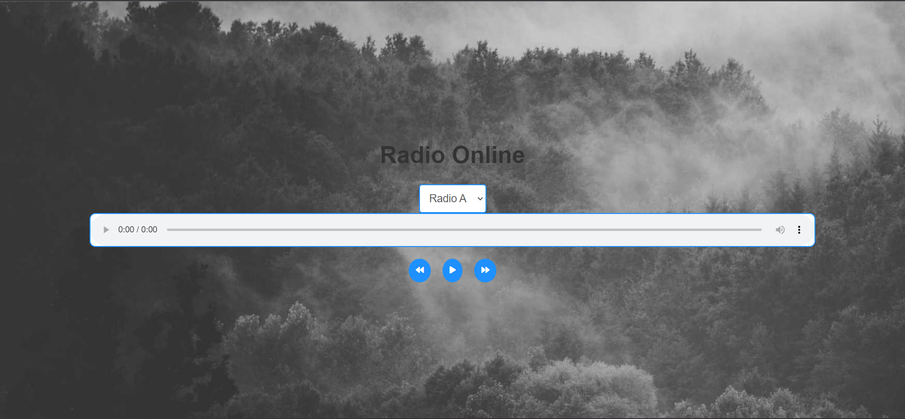

# RADIO WEB

## # Penjelasan Code

```html
<audio id="radioPlayer" controls>
  <source id="radioSource" src="" type="audio/mpeg" />
</audio>
```

jadi kami menggunakan audio untuk menampilakan memutar lagu yang kami sudah terakan link urlnya pada bagian javascript.

```javascript
const radioStreams = {
  radio1: "http://stream-157.zeno.fm/gaaa0t09ewzuv?zs=H2pMnnlYT5-6ndfQbrTI5w",
  radio2:
    "https://rautemusik-de-hz-fal-stream15.radiohost.de/solopiano?ref=radiobrowser",
  radio3: "https://0n-christmas.radionetz.de/0n-christmas.aac",
  radio4: "https://0n-christmas.radionetz.de/0n-christmas.mp3",
  radio5: "https://0n-jazz.radionetz.de/0n-jazz.aac",
};
```

berikut link urlnya , kami menggunakan library audio-browser di node js untuk mendapatkan linknya.jadi kami konfigurasi audio-browser menggunakan axios.

```javascript
const RadioBrowser = require("radio-browser");
const express = require("express");
const app = express();
const port = 3000;

app.get("/radio/:limit/:by/:tag", (req, res) => {
  const limit = req.params.limit;
  const by = req.params.by;
  const tag = req.params.tag;

  let filter = {
    limit: parseInt(limit),
    by: by,
    searchterm: tag,
  };

  RadioBrowser.getStations(filter)
    .then((data) => {
      const stations = data.map((stations) => ({
        nama: stations.name,
        url: stations.url,
        url_resolve: stations.url_resolved,
        favicon: stations.favicon,
      }));
      res.send(stations);
      console.log(stations.length);
    })
    .catch((error) => console.error(error));
});

app.listen(port, () => {
  console.log(`Server is running at http://localhost:${port}/radio/5/tag/jazz`);
});
```

### berikut hasil dari node js :


### hasil dari html



## installation

```bash
git clone https://github.com/khuluqilkarim/web-radio.git
cd web-radio
npm install
node main.js
```

copy and paste url yang didapatkan
